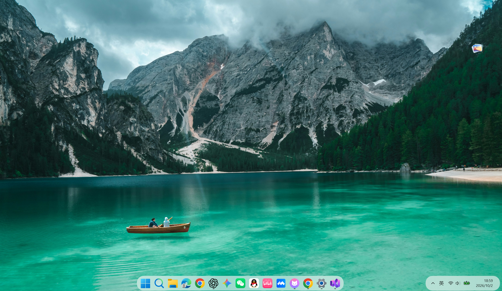

# 民办mac

**喜欢 macOS 的简约感，也能继续用熟悉的 Windows。**

一套给 Windows 11 用的圆角悬浮任务栏预设。

## 下载并启用

### [下载一键切换包 · 民办mac 1.0.0](https://github.com/Holmes-zhang/minban-mac/releases/download/v1.0.0/%E6%B0%91%E5%8A%9Emac-1.0.0.zip)

1. 点击上面的下载链接，获取 **民办mac-1.0.0.zip**。
2. 解压到普通文件夹，双击 **应用民办mac.cmd**。
3. 等待提示“应用完成”，就可以使用了。

**启用入口：应用民办mac.cmd**　｜　**恢复入口：恢复原任务栏.cmd**

请完整解压后再运行，不要在压缩包里直接双击。

首次需要联网下载官方组件，其中 Windhawk 安装包约 **142 MiB**；以后会复用本机缓存。首次加载也可能需要下载 Windows 符号，请耐心等候。

**想换回去？** 双击 **恢复原任务栏.cmd**，回到应用前的方案。原来的壁纸、桌面文件和应用仍然保留。

## 桌面效果

居中排列的应用、柔和的半透明背景，以及独立的时间与状态区域，让桌面看起来更轻巧。

> 上图为实际桌面截图。壁纸和应用排列由你自己决定，切换包不会更换你的壁纸或应用图标。

## 好看，也顺手

- **圆润悬浮**：应用区和右侧状态区分别成组，浅色半透明背景更轻盈。
- **需要时出现**：前台窗口最大化时隐藏，鼠标移到任务栏对应的底部区域即可唤起。
- **唤起更快**：缩短等待时间，加快滑入动画；实际流畅度取决于电脑和显示器。
- **留住搜索**：放大镜按钮打开 Windows 原生搜索，找应用和文件仍然方便。
- **减少干扰**：收起任务视图与小组件按钮，保留常用应用和系统托盘。
- **开机自动加载**：设置完成后，下次登录会自动启用。

## 适合你的电脑吗？

| 项目 | 支持情况 |
| --- | --- |
| 系统 | Windows 11 x64 |
| Windows 10 / ARM64 | 暂不支持 |
| 首次使用 | 需要联网 |
| 多屏、不同缩放比例 | 尚未完整验证，建议先试用 |

目前的外观已在 Windows 11 build 26200 上使用和调试。切换与恢复逻辑通过隔离检查；全新电脑首次安装尚未完整实机验证，本版先作为试用版本发布。

如果已经使用其他任务栏美化工具，请先退出，避免同时修改任务栏。检测到标准安装版 Windhawk 服务时，本包会停止，并提示你先处理原安装。

## 常见问题

**搜索还是一条长框？**

双击 **任务栏设置.cmd**，在“搜索”中选择 **仅搜索图标**。部分 Windows 版本需要手动设置一次。

**下载失败？**

先确认能访问 GitHub。需要代理时，双击 **网络设置.cmd**，填入你自己的 HTTP/HTTPS 代理地址；留空使用默认网络。下载失败或校验不通过时，文件不会被运行。

**应用失败，或想撤回？**

运行 **恢复原任务栏.cmd**。如果提示某项设置被其他操作改变，会保留你的后续修改并提示检查。请保留本地恢复记录。

**为什么开机不是第一瞬间就显示新样式？**

需要等 Windows 登录、任务栏初始化和模组加载完成。启动已取消额外延迟，但仍会受系统、磁盘和网络影响。

更多问题见 [故障处理](docs/TROUBLESHOOTING.md)。

## 致谢与许可

基于 [Windhawk](https://github.com/ramensoftware/windhawk) 及其模组，使用 **Amber** 制作的 [DockLike](https://github.com/ramensoftware/windows-11-taskbar-styling-guide/blob/main/Themes/DockLike/README.md) 主题基础。感谢 **m417z、Bo0ii** 和上游贡献者。

本项目脚本、说明与预设调整采用 [GPL-3.0-only](LICENSE)。上游组件保留各自许可，详见 [第三方声明](THIRD-PARTY-NOTICES.md)。截图中的壁纸和应用标识保留各自权利。

“民办mac”是项目昵称，与 Apple、macOS 或上游项目没有隶属关系。
